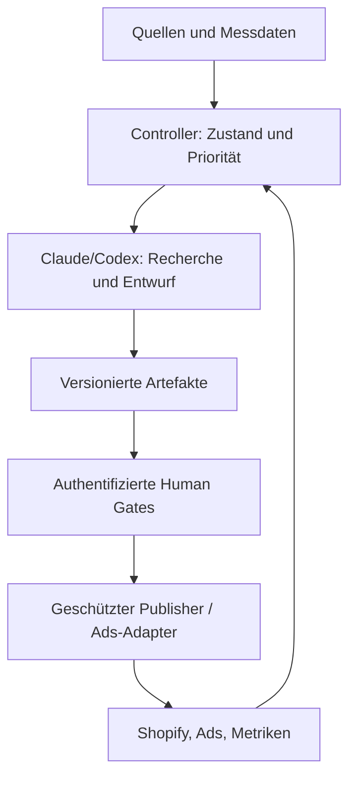

# Deep Research: Hypothesen-Test-Factory für Premium-Aufbewahrung

**Stand:** 26. September 2026 · **Marktfokus:** Deutschland · **Ausgangsdokument:** „Hypothesen-Test-Factory_Briefing.md“ aus diesem Gespräch

> **Leseschlüssel:** **Befund** = durch die angegebene Quelle gedeckt; **Ableitung** = meine Interpretation der Befunde; **Hypothese** = noch zu testen; **Offen** = weder durch diese Recherche noch durch einen Account-Test geklärt. Produktpreise sind Momentaufnahmen und beziehen sich auf unterschiedliche Größen, Umfänge und Märkte. Alle verlinkten Plattformangaben müssen unmittelbar vor einer Freigabe erneut geprüft werden.

## 1. Kurzfazit und Entscheidungsvorlage

Die Factory ist als **gestuftes System mit persistenten Artefakten und technisch erzwungenen Human Gates** grundsätzlich plausibel. Der entscheidende Architekturpunkt ist die Trennung von Recherche- und Entwurfsarbeit einerseits und der Verwendung produktiver Shopify- und Ads-Credentials andererseits. Shopify erlaubt mit einem Page-Write-Scope, eine Seite bereits veröffentlicht anzulegen; eine bloße Anweisung „Agent darf nur Entwürfe“ schützt das Gate daher nicht. [Shopify `pageCreate`](https://shopify.dev/docs/api/admin-graphql/latest/mutations/pageCreate)

**Marktbefund:** Das Sortiment ist dicht besetzt. IKEA, Mepal, Zwilling, OXO, Rotho, Joseph Joseph und andere bieten bereits Glas, Stapelbarkeit, austauschbare Deckel, Spezialbehälter und organisierte Sets. „Modular“, „schön“ und „weniger Plastik“ sind ohne präziseren Nutzen keine belegte Marktlücke. [IKEA 365+](https://www.ikea.com/de/de/p/ikea-365-vorratsbehaelter-mit-deckel-rechteckig-glas-kunststoff-s89269071/) · [Joseph Joseph Nest Lock](https://de.josephjoseph.com/products/nest-lock-5-teiliges-aufbewahrungsbehalter-set-mehrfarbig) · [Zwilling Fresh & Save](https://www.zwilling.com/de/zwilling-fresh-save-vakuum-starter-set-glas-%2F-s%2Fm-7-tlg-weiss-36806-006-0/)

**Aussichtsreichste Lernfragen, keine validierten Gewinner:** (1) geruchsintensiven Käse praktisch lagern, ohne Kondenswasserproblem; (2) ein langfristig konsistentes Behältersystem mit wenigen Deckelformaten und tatsächlich nachkaufbaren Ersatzteilen. Beide Probleme sind aus Nutzeräußerungen nachvollziehbar; bestehende Angebote lösen Teilaspekte. Insbesondere darf Käse **nicht** pauschal als „luftdicht zu lagern“ beworben werden: Die Verbraucherzentrale empfiehlt gerade keine luftdichte Verpackung. [Verbraucherzentrale zur Käselagerung](https://www.verbraucherzentrale.de/wissen/lebensmittel/auswaehlen-zubereiten-aufbewahren/kaese-butter-und-milchprodukte-alles-zu-haltbarkeit-und-lagerung-58931) · [Kilner Cheese Store](https://www.kilnerjar.co.uk/cheese-store/)

**Nachfrage ist offen:** Weder die Menge an Lebensmittelabfällen noch Wettbewerberlisten, einzelne Rezensionen oder eine Warteliste beweisen Zahlungsbereitschaft für ein bestimmtes Premiumprodukt. Der nächste Erkenntnisschritt ist ein ehrlicher Konzepttest mit eindeutigem Set-Umfang und Testpreis, gefolgt von qualitativen Interviews und später einem realen Kauf- oder Reservierungsindikator. [Umweltbundesamt zu Lebensmittelabfällen](https://www.umweltbundesamt.de/themen/abfall-ressourcen/abfallwirtschaft/abfallvermeidung/lebensmittelabfaelle)

**Status des gewünschten unabhängigen Gegenchecks:** Dieser Bericht ist meine quellenbasierte Prüfung des Briefings. Ein separater Claude-Lauf wurde nicht ausgeführt, da hier kein Claude-Zugang verbunden ist. Abschnitt 15 enthält einen sofort kopierbaren Prüfauftrag samt Widerspruchsmatrix. Die zwei Recherchen dürfen erst nach dem tatsächlichen Gegencheck als unabhängig abgeglichen gelten.

### Wichtigste Korrekturen am Briefing

| Aussage/Annahme | Prüfung | Konsequenz |
| --- | --- | --- |
| „Modularität plus Ästhetik“ als Differenzierung | Bereits verbreitet; viele Systeme decken Teilaspekte ab. | Job und belegbarer Mechanismus müssen konkret sein. |
| „Käse luftdicht und frisch“ | Fachliche Lagerempfehlung spricht gegen luftdicht; vorhandene Käseboxen adressieren Feuchte und Geruch. | Kein Haltbarkeitsversprechen; Feuchte-/Geruchskonflikt erst technisch und mit Nutzern prüfen. |
| €25/Tag als kanalübergreifendes Beispiel | TikTok verlangt laut Dokumentation ein Kampagnenbudget **über 50 USD** pro Tag oder insgesamt und Ad-Group-Tagesbudget **über 20 USD**. | €25/Tag ist dort nicht als belastbare Standardplanung geeignet. [TikTok-Budget](https://ads.tiktok.com/resources/help/article/about-daily-budgets?lang=en-GB) |
| Google Shopping für einen bloßen Concept-Test | Merchant Center verlangt zum Verfügbarkeitsstatus passende tatsächliche Angebote; „Vorbestellung“ bedeutet echte Bestellung mit Verfügbarkeitsdatum. | Warteliste nicht als verfügbares Shopping-Produkt einreichen. [Google Merchant Center](https://support.google.com/merchants/answer/6324448?hl=en-GB) |
| Shopify-MCP als umfassender Admin-Zugang | Storefront MCP richtet sich an Kauf-/Storefront-Funktionen; Admin-Aktionen laufen über passende APIs/Tools. | Shopify-spezifische Funktionen je Aktion prüfen, nicht „MCP vorhanden“ mit allen Rechten gleichsetzen. [Shopify Storefront MCP](https://shopify.dev/docs/apps/build/storefront-mcp/servers/storefront) · [AI Toolkit](https://shopify.dev/docs/apps/build/ai-toolkit) |
| Plan-Abos als „unbegrenzte“ 24/7-Worker | Claude und Codex haben Nutzungsgrenzen; separate API-Rechnungen sind möglich. Eine aktuelle Claude-Seite hat einen später ausgesetzten Planwechsel im selben Artikel stehen. | Accountbezogenen Test und Budgetierung vor Dauerbetrieb durchführen. [Claude-Update](https://support.claude.com/en/articles/15036540-use-the-claude-agent-sdk-with-your-claude-plan) · [Codex-Plan](https://help.openai.com/de-de/articles/11369540-using-codex-with-your-chatgpt-plan) |
| Controller-Stop-Loss als harte Ausgabengrenze | Plattformen können Tagesbudgets überziehen; Reports und Pause-Operationen können verzögert sein. | Freigabe eines maximal tragbaren Risikos plus plattformseitige Limits, Puffer und Alerts. [Google-Tagesbudget](https://support.google.com/google-ads/answer/10486637?hl=en) · [Pinterest-Budget](https://help.pinterest.com/en/business/article/set-up-campaign-budgets) |

## 2. Vorgehen, Belegstärke und Grenzen

Geprüft wurden Hersteller- und Händlerangebote als **Primärbelege für existierende Produkte und ausgewiesene Preise**, öffentliche Nutzeräußerungen als **qualitative Problemhinweise**, Verbraucherinformationen für Lagerhinweise, offizielle Dokumentation von Shopify, Werbeplattformen, OpenAI und Anthropic sowie deutsche/EU-Rechtsquellen. Preise, Richtlinien und Tools sind zeitabhängig. Ein einzelner Review belegt nur, dass diese Person ein Problem beschrieben hat; er schätzt keine Häufigkeit. Für tatsächliche Suchvolumina, Klickpreise, deutsche Absatzmengen, Wiederkauf, Stückkosten oder eine repräsentative Umfrage standen hier keine Account- oder Befragungsdaten zur Verfügung. Keine dieser Größen wird im Folgenden als gemessen ausgegeben.

| Belegart | Aussage, die sie trägt | Aussage, die sie nicht trägt |
| --- | --- | --- |
| Offizielle API-/Policy-Dokumentation | Dokumentierte Funktion, Scope, Mindestbudget, Regel | Tatsächliche Freigabe des konkreten Accounts oder einer bestimmten Anzeige |
| Hersteller-Produktseite | Sichtbares Sortiment, genannte Ausstattung und Preis am Prüftag | Unabhängig verifizierte Produktleistung, Marktanteil |
| Verbraucherzentrale | Allgemeine Lagerempfehlung | Eignung eines noch nicht existierenden Behälters |
| Einzelne Rezension/Forenbeitrag | Existenz einer artikulierten Friktion | Prävalenz, repräsentative Nachfrage, Zahlungsbereitschaft |
| Concept-Test | Reaktion auf konkrete Seite, Zielgruppe und Akquise | Sichere spätere Käufe oder erzielbare Deckungsbeiträge |

**Zu falsifizieren:** (i) Ist der identifizierte Schmerz regelmäßig und teuer genug? (ii) Löst das Konzept ihn physikalisch plausibel besser als vorhandene Produkte? (iii) Werden die notwendigen Preise akzeptiert? (iv) Kann die Factory die zulässigen Tests tatsächlich reproduzierbar und kontrolliert ausführen?

## 3. Markt und Kundenproblem

### 3.1 Kontext ohne Größenfehlschluss

Das Umweltbundesamt beziffert Lebensmittelabfälle in Deutschland für 2023 auf rund **10,9 Mio. Tonnen**, davon rund **58 %** in privaten Haushalten. Das begründet die Relevanz richtiger Lagerung als Thema, aber weder eine adressierbare Premiumbehälter-Marktgröße noch eine durch unser Konzept vermeidbare Menge. Das Bundeszentrum für Ernährung behandelt sachgerechte Lagerung als möglichen Beitrag gegen Verderb. [UBA](https://www.umweltbundesamt.de/themen/abfall-ressourcen/abfallwirtschaft/abfallvermeidung/lebensmittelabfaelle) · [BZfE](https://www.bzfe.de/kueche-und-alltag/kochen/lebensmittel-richtig-lagern)

Der spannendere Ausgangspunkt sind **konkrete Reibungen**: Deckel, die nach einem Sortimentswechsel nicht mehr passen; zu viele Formate; Bruch oder Verlust einzelner Teile; Geruch und Feuchte bei Käse; Obst und Gemüse, das sichtbar und greifbar bleiben soll. Dazu existieren qualitative Hinweise, unter anderem ein ausführlicher Wunsch nach denselben Grundflächen und Deckeln sowie Beschwerden über inkompatible oder gebrochene Deckel. Das sind Suchsignale für Interviews, keine repräsentative Stichprobe. [Nutzerbeitrag zu Formaten](https://www.reddit.com/r/BuyItForLife/comments/10lhdv5/looking_for_various_size_glass_food_storage/) · [IKEA-Bewertungen als gemischtes Signal](https://www.ikea.com/de/de/p/ikea-365-vorratsbehaelter-mit-deckel-rechteckig-glas-kunststoff-s89269071/)

### 3.2 Job-to-be-done-Landkarte

Die Priorität beschreibt den **Research-Wert**, keine erwiesene Produktchance. „Direkt“ bedeutet, dass eine konkrete Quelle den Job oder einen Teil davon anspricht; „plausibel“ bedeutet, dass erst Interviews belegen müssen, ob Menschen diesen Job wichtig genug finden.

| Nr. | Situation und gewünschter Fortschritt | Indiz / Gegenangebot | Priorität für Interviews |
| ---: | --- | --- | --- |
| 1 | Nach dem Einkauf Käse lagern und starke Gerüche begrenzen, ohne ihn feucht einzuschließen. | Verbraucherzentrale rät von luftdicht ab; [Kilner](https://www.kilnerjar.co.uk/cheese-store/) bietet Lüftung/abnehmbare Dichtung. | Hoch, aber physikalische Lösung offen |
| 2 | Geöffnete Käsearten getrennt sichtbar und hygienisch handhaben. | [Mepal Käsebox](https://www.mepal.com/de/kasedose-modula-weis-106934030600), [Rotho Käseglocke](https://rotho.com/products/kaseglocke-fresh). | Mittel |
| 3 | Aufschnitt für wiederkehrende Frühstücke schnell zugänglich und stapelbar halten. | [Mepal Aufschnittdose](https://www.mepal.com/de/aufschnittdose-modula-550-3-weis-106938030600) bedient den Job preisgünstig. | Niedrig für Premium, falls kein Zusatznutzen |
| 4 | Viele Behälter mit möglichst wenigen Deckelformaten organisieren. | [Nutzerbericht](https://www.reddit.com/r/BuyItForLife/comments/10lhdv5/looking_for_various_size_glass_food_storage/), [Joseph Joseph](https://de.josephjoseph.com/products/nest-lock-5-teiliges-aufbewahrungsbehalter-set-mehrfarbig). | Hoch |
| 5 | Einen kaputten Deckel oder eine Dichtung ersetzen, statt ein ganzes Set zu entsorgen. | [Pyrex Ersatzdeckel](https://www.pyrex.eu/de/collections/ersatzteile), [IKEA-Modulsystem](https://www.ikea.com/de/de/p/ikea-365-vorratsbehaelter-mit-deckel-rechteckig-glas-kunststoff-s89269071/). | Hoch, aber Versorgungskosten prüfen |
| 6 | Reste und Meal Prep in Glas aufbewahren, erwärmen und platzsparend stapeln. | [IKEA 365+](https://www.ikea.com/de/de/p/ikea-365-vorratsbehaelter-mit-deckel-rechteckig-glas-kunststoff-s89269071/), [Zwilling](https://www.zwilling.com/de/zwilling-fresh-save-vakuum-starter-set-glas-%2F-s%2Fm-7-tlg-weiss-36806-006-0/), [EMSA Divider](https://www.emsa.com/produkt/clip-close-frischhaltedose-glas-rechteckig-mit-divider). | Mittel; dicht besetzt |
| 7 | Frisches Gemüse sichtbar halten und Feuchtigkeit handhaben. | [Rotho Dynamic Box](https://rotho.com/collections/fresh-dynamic-box), [OXO Food Storage](https://www.oxo.com/shop/kitchenware/food-storage.html). | Mittel; Leistung erst prüfen |
| 8 | Kräuter und empfindliche Zutaten verfügbar halten. | [OXO-Produktfamilie](https://www.oxo.com/shop/kitchenware/food-storage.html). | Mittel |
| 9 | Im kleinen Kühlschrank ein einheitliches Raster schaffen. | [Joseph Joseph Nest Glass](https://de.josephjoseph.com/products/nest-aufbewahrunsgbehalterset-aus-glas-mehrfarbig) und diverse Stapelsysteme. | Mittel |
| 10 | Inhalt ohne Öffnen sehen und beim Einkauf Doppelkäufe vermeiden. | Transparente Systeme wie [Mepal Modula](https://www.mepal.com/de/kasedose-modula-weis-106934030600). | Plausibel, Nutzenmessung offen |
| 11 | Unterschiedliche Haushaltsmitglieder zur Rückgabe an feste Plätze bewegen. | Farbcodierung existiert, z. B. [Nest Lock](https://de.josephjoseph.com/products/nest-lock-5-teiliges-aufbewahrungsbehalter-set-mehrfarbig). | Plausibel, Interviewbedarf |
| 12 | Ein System besitzen, das nach Jahren erweiterbar bleibt. | Wechselnde Serien können Friktion auslösen; [IKEA-Rezensionen](https://www.ikea.com/de/de/p/ikea-365-vorratsbehaelter-mit-deckel-rechteckig-glas-kunststoff-s89269071/) und Ersatzdeckelangebote zeigen beide Seiten. | Hoch, Zusage organisatorisch schwer |
| 13 | Ein auf der Arbeitsplatte oder beim Servieren vorzeigbares Set verwenden. | [IKEA Glas/Bambus](https://www.ikea.com/de/de/p/ikea-365-vorratsbehaelter-mit-deckel-rechteckig-glas-bambus-s09269065/), [Caraway](https://www.carawayhome.com/products/complete-food-storage-bundle?color=navy&group=utensil-set&quantity=single&value=750). | Plausibel; ästhetische Präferenz segmentieren |
| 14 | Kunststoffkontakt vermeiden, ohne schwere und unhandliche Behälter zu akzeptieren. | Glas-/Metall-/Kunststoffsysteme im Handel; tatsächliche Materialpräferenz offen. | Mittel |

**Ableitung:** Ein gutes Einstiegsprodukt kann ein enger „Hero Job“ sein, während die Marke später ein konsistentes Gesamtsystem aufbaut. Für Käse spricht die Schärfe des Konflikts; gegen Käse sprechen kleinerer Einsatzbereich, vorhandene Speziallösungen und der Nachweisaufwand. Für Deckelstandardisierung spricht die Breite; dagegen die Existenz funktionierender Systeme und die langfristige Ersatzteilverpflichtung.

### 3.3 Wettbewerbsbild: verifizierte Beispiele

| Angebot / Markt | Beobachtbarer Nutzen | Preisbeispiel der Quelle | Bedeutung für unsere Hypothesen |
| --- | --- | --- | --- |
| [IKEA 365+ Glas/Kunststoff, DE](https://www.ikea.com/de/de/p/ikea-365-vorratsbehaelter-mit-deckel-rechteckig-glas-kunststoff-s89269071/) | 1-l-Glasbehälter mit Deckel; großes System | €3,79 für die verlinkte Variante beim Abruf | Starker günstiger Systemanker |
| [IKEA 365+ Glas/Bambus, DE](https://www.ikea.com/de/de/p/ikea-365-vorratsbehaelter-mit-deckel-rechteckig-glas-bambus-s09269065/) | Material-/Designalternative | €6,29 für die verlinkte Variante beim Abruf | „Glas plus Naturdeckel“ ist vorhanden |
| [Mepal Modula Käse, DE](https://www.mepal.com/de/kasedose-modula-weis-106934030600) | Käse-Aufbewahrung, 2 l | €11,99 beim Abruf | Käsebox allein ist keine Neuheit |
| [Mepal Modula Aufschnitt 550/3, DE](https://www.mepal.com/de/aufschnittdose-modula-550-3-weis-106938030600) | Flache Aufschnittorganisation | €5,69 beim Abruf | Schwacher Premium-Einstieg ohne Mehrwert |
| [Kilner Cheese Store, UK](https://www.kilnerjar.co.uk/cheese-store/) | Spezialkäsebehälter mit entfernbarer Dichtung | UVP £21,00 | Feuchte-/Geruchskompromiss schon adressiert; UK-Preis kein DE-Benchmark |
| [Rotho Käseglocke, DE](https://rotho.com/products/kaseglocke-fresh) | Käsepräsentation und -lagerung | Preis hier nicht belastbar erfasst | Direkter Käsewettbewerb |
| [Rotho Fresh Dynamic Box, DE](https://rotho.com/collections/fresh-dynamic-box) | Gemüse-Frischekonzept mit technischer Funktion | Preis hier nicht belastbar erfasst | Gegenprobe zu Gemüse-Proposition |
| [Zwilling Fresh & Save Glas, DE](https://www.zwilling.com/de/zwilling-fresh-save-vakuum-starter-set-glas-%2F-s%2Fm-7-tlg-weiss-36806-006-0/) | 7-teiliges Vakuum-Starterset | €84,95 beim Abruf | Premiumpreis existiert, ohne dass daraus unsere Zahlungsbereitschaft folgt |
| [OXO Food Storage, USA](https://www.oxo.com/shop/kitchenware/food-storage.html) | Behälter, Produce Saver, diverse Sets | 12-teiliges Smart-Seal-Beispiel $34,99 beim Abruf | Breites funktionales Sortiment, anderer Markt |
| [Joseph Joseph Nest Lock, DE](https://de.josephjoseph.com/products/nest-lock-5-teiliges-aufbewahrungsbehalter-set-mehrfarbig) | Farbcodiertes, verschachteltes Deckel-/Boxensystem | Preis hier nicht belastbar erfasst | Organisierbarkeit ist besetzt |
| [Joseph Joseph Nest Glass, DE](https://de.josephjoseph.com/products/nest-aufbewahrunsgbehalterset-aus-glas-mehrfarbig) | Stapelbares Glasset | Preis hier nicht belastbar erfasst | Design plus Glas ist vorhanden |
| [EMSA Clip & Close Glas mit Divider, DE](https://www.emsa.com/produkt/clip-close-frischhaltedose-glas-rechteckig-mit-divider) | Unterteiltes Glasbehältnis | Preis hier nicht belastbar erfasst | Trenner kein Alleinstellungsmerkmal |
| [LocknLock The Clear, DE](https://locknlock.de/produkt/frischhaltedose-aus-glas-fuer-backofen-mikrowelle/) | Glas und Deckelsystem | Preis hier nicht belastbar erfasst | Weitere massenmarkttaugliche Alternative |
| [Pyrex Ersatzteile, EU](https://www.pyrex.eu/de/collections/ersatzteile) | Separat erhältliche Deckel; einzelne Cook&Go-Varianten ab €6 in der Quelle | Varianten und Lieferländer gesondert prüfen | Ersatzteile als Prinzip existieren |
| [Caraway Food Storage, USA](https://www.carawayhome.com/products/complete-food-storage-bundle?color=navy&group=utensil-set&quantity=single&value=750) | Hochpreisig kuratierte Sets | Varianten/Discounts ändern Preis; kein DE-Anker | Premium-Inszenierung existiert in anderem Markt |

**Grenze:** Das ist eine gezielte, nachvollziehbare Konkurrenzstichprobe und **keine erschöpfende Kartierung von 30–50 Marken/SKUs**. Unterschiedliche Währungen, Sets, Deckelmaterialien, Funktionen und Rabatte verbieten eine direkte Durchschnittspreisberechnung. Vor einer Produkt- oder Investitionsentscheidung: systematische deutsche SKU-Matrix mit Größe, Material, Stack-Footprint, Dichtung, Ersatzteilverfügbarkeit, UVP/Aktionspreis, Rückgabebedingungen und realen Nutzerkritiken erstellen.

## 4. Priorisierte Hypothesis Cards für Gate 1

Die genannten Preise sind **Testanker für eine Befragung**, keine Kostenschätzung, Preisempfehlung oder belegte Zahlungsbereitschaft. Vor einer öffentlichen Seite muss der physische Leistungsumfang präzisiert und auf technische Glaubwürdigkeit geprüft werden. Gate 1 wählt lediglich aus, *welche Fragen* als Nächstes gebaut und getestet werden.

### P01 – Käse ohne Geruchspanik und Schwitzwasser

| Feld | Forschungsstand |
| --- | --- |
| Nutzer/Anlass | Haushalte, die mehrere geöffnete Käsearten und geruchsintensive Sorten im Kühlschrank lagern. |
| Problem | Geruchsschutz kann mit Luft- und Feuchtebedarf kollidieren. Verbraucherzentrale empfiehlt keine luftdichte Käseverpackung; [Kilner](https://www.kilnerjar.co.uk/cheese-store/) zeigt bereits einen anderen Kompromiss. |
| Mögliche Proposition | „Ein übersichtliches System für Käse, das Gerüche im Kühlschrank besser handhabbar macht und Feuchte sichtbar kontrollierbar hält.“ **Nur als Hypothese; konkrete Leistungswörter brauchen einen echten technischen Mechanismus.** |
| Konzeptumfang für Test | Beispiel: Basis, separierbare Einsätze, variabler Luft-/Feuchtepfad, passende Abdeckung. Welche Komponenten tatsächlich funktionieren, ist **offen**. |
| Preisfrage | „Wäre ein klar definierter 2-/3-teiliger Starterumfang bei €69/€89 überhaupt eine Option?“ Diese Beträge messen allenfalls Reaktion auf Anker. |
| Falsifikation | Nutzer akzeptieren normale Käseglocke/Papier; hygienischer oder geruchlicher Vorteil nicht nachweisbar; Reinigung nervt; Preis zu hoch. |
| Benötigter Nachweis | 10–15 problemorientierte Interviews als Arbeitsziel; Lösungsprototyp mit Kondensat-/Geruchsbeobachtung; Vergleich gegen mindestens Mepal/Kilner/Rotho. |
| Vorläufige Einstufung | **Gate-1-Kandidat A**, hohe Lernschärfe, technische Ungewissheit hoch. |

### P02 – Wenige Deckel, viele Größen, Ersatz über Jahre

| Feld | Forschungsstand |
| --- | --- |
| Nutzer/Anlass | Meal-Prep- oder Familienhaushalt mit überfüllter Deckelschublade und wechselndem Behälterbestand. |
| Problem | Mismatched lids/alte Serien werden in qualitativen Nutzerberichten genannt; bestehende Anbieter haben bereits modulare und nachkaufbare Teile. [Nutzerbericht](https://www.reddit.com/r/BuyItForLife/comments/10lhdv5/looking_for_various_size_glass_food_storage/) · [IKEA](https://www.ikea.com/de/de/p/ikea-365-vorratsbehaelter-mit-deckel-rechteckig-glas-kunststoff-s89269071/) |
| Mögliche Proposition | „Ein auf zwei Grundflächen aufgebautes Küchensystem mit wenigen Deckelformaten und einzeln bestellbaren Verschleißteilen.“ Zwei Flächen sind ein **Designvorschlag**, kein validiertes Optimum. |
| Konzeptumfang für Test | Exakte Stückliste, Größen, Deckelmaterial, Spülmaschinenfähigkeit und Ersatzteilpolitik müssen vor Preistest definiert werden. |
| Preisfrage | Beispielhaft €89/€119 für ein *klar ausgewiesenes* Startset; ohne Stückliste nicht sinnvoll. |
| Falsifikation | IKEA/Joseph/Pyrex lösen Problem schon hinreichend; System passt nicht in reale Kühlschränke; Ersatzteilversprechen ist betriebswirtschaftlich untragbar. |
| Benötigter Nachweis | Deckelinventar in Interviews, direkte Konkurrenz-Nutzungstests, Footprint- und Kompatibilitätsprüfung, Ersatzteil-/MOQ-Kalkulation. |
| Vorläufige Einstufung | **Gate-1-Kandidat B**, breites Problem, hoher Differenzierungs- und Operationsnachweis. |

### P03 – Gemüse sichtbar und ohne stehende Nässe organisieren

| Feld | Forschungsstand |
| --- | --- |
| Nutzer/Anlass | Haushalte mit regelmäßigem Gemüseinkauf und chaotischem Gemüsefach. |
| Problem | Sichtbarkeit, Platz und Feuchtehandhabung; vorhandene Produce-Saver bedienen den Bereich. [Rotho](https://rotho.com/collections/fresh-dynamic-box) · [OXO](https://www.oxo.com/shop/kitchenware/food-storage.html) |
| Mögliche Proposition | „Modulare Gemüseorganisation mit herausnehmbarer Feuchtezone und Blick auf den Inhalt.“ Keine pauschale zusätzliche Haltbarkeit behaupten. |
| Preisfrage | Beispielsweise €79/€99 für drei genau definierte Module; offen. |
| Falsifikation | Bestehende Lösungen günstiger/einfacher; Volumenverlust durch Einsätze; Reinigung und Kondensat unpraktisch; keine Premiumbereitschaft. |
| Benötigter Nachweis | Nutzungstests in verschiedenen Kühlschranktypen, Interviews und Produktvergleich. |
| Vorläufige Einstufung | **Gate-1-Kandidat C**, gute visuelle Testbarkeit, sehr starke Konkurrenz. |

### P04 – Kompaktes Familien-Frühstücksset

**Hypothese:** Aufschnitt, Butter und Käse mit wenigen Handgriffen auf den Tisch und zurück in den Kühlschrank bringen. [Mepal Aufschnittdose](https://www.mepal.com/de/aufschnittdose-modula-550-3-weis-106938030600) und [Rotho Käseglocke](https://rotho.com/products/kaseglocke-fresh) belegen bestehende Teillösungen. **Gate-1-Einstufung: Reservekandidat.** Erst nach Interviews ausbauen, wenn tägliche Zeitersparnis, Tischästhetik oder Familienabläufe einen klaren Premiumaufschlag rechtfertigen. Eine schöne Box zum deutlich höheren Preis genügt nicht als Proposition.

### P05 – Die visuelle Ordnung des gesamten Kühlschranks

**Hypothese:** Haushalte kaufen ein ästhetisch konsistentes, erweiterbares Ordnungssystem als Gesamtpaket. **Gate-1-Einstufung: späterer System-/Bundle-Test**, weil der breite Anspruch viele Module, Investitionen, Bilder und Varianten voraussetzt und bereits existierende Glassysteme dagegen stehen. Als Markenvision denkbar; als erster Falsifikationstest weniger scharf als P01 oder P02. [IKEA 365+](https://www.ikea.com/de/de/p/ikea-365-vorratsbehaelter-mit-deckel-rechteckig-glas-kunststoff-s89269071/) · [Joseph Joseph](https://de.josephjoseph.com/products/nest-aufbewahrunsgbehalterset-aus-glas-mehrfarbig)

**Meine Priorisierung:** P01 und P02 für Gate 1 nebeneinander prüfen; P03 als bewusste Alternative; P04/P05 erst nach zusätzlicher Evidenz. Das ist eine Entscheidung über *Informationsgewinn pro Test*, nicht eine Prognose über Umsatz.

## 5. Ehrliche Concept Tests und Werbekanäle

### 5.1 Was die Seite aussagen darf

Ein Prototyp ist als **Konzept in Entwicklung** zu kennzeichnen; Illustration/Rendering als solche kenntlich machen. Ein klarer Satz oberhalb der Anmeldung: „Dieses Produkt ist noch nicht erhältlich. Wir testen derzeit das Interesse am beschriebenen Konzept. Mit deiner Anmeldung erhältst du [genau festgelegte Nachricht]. Es gibt keine Bestellung und keine Zahlung.“ Die genaue Formulierung ist vor Veröffentlichung rechtlich und je Werbekanal zu prüfen. Eine angezeigte Preisidee darf nicht wie ein verfügbarer Kaufpreis mit Versandversprechen aussehen. Behauptungen zu Haltbarkeit, Vermeidung von Schimmel, Lebensmittelersparnis, Geruchsdichtigkeit oder geprüftem Material erst nach entsprechendem Nachweis verwenden.

Die Seite soll einen **konkreten Setumfang** zeigen: Skizze/Bild, Maße soweit definiert, Materialstatus, enthaltene Teile, Preisanker als hypothetisch, Zeitpunkt/Unsicherheit und ein freiwilliges Opt-in. Anmeldebestätigung und spätere Werbemails sind getrennte Vorgänge. Der Conversion-Event soll den tatsächlich bestätigten Schritt messen, nicht bloß einen Klick auf „Interessiert“.

### 5.2 Policy-Matrix, Stand der öffentlichen Dokumentation

| Kanal / Format | Dokumentierter Befund | Urteil für explizit gekennzeichnete Warteliste | Account-Prüfung vor Start |
| --- | --- | --- | --- |
| **Pinterest normale Anzeige zur Research-/Early-Access-Seite** | [Advertising Guidelines](https://policy.pinterest.com/en/advertising-guidelines) verlangen zutreffende Darstellung und passende Zielseite; irreführende Produktverfügbarkeit ist problematisch. | **Möglichkeit, keine Freigabezusage.** Text und Landingpage müssen gleich klar sagen, dass es nur eine Konzeptinteressenliste gibt. | Anzeigenvorschau, Policy-Review, zulässiges Ziel/Format, Konto- und Länderrestriktionen. |
| **Pinterest Produkt-Pins/Katalog** | [Merchant Guidelines](https://policy.pinterest.com/de/merchant-guidelines) betreffen reale Produkte, Verfügbarkeit und aktuelle Angaben. | **Kein naheliegender Weg** für ein rein fiktives, nicht kaufbares Produkt. | Händlerkonto/Feed separat prüfen, erst bei echtem Angebot. |
| **TikTok Website Lead Gen** | [Website-Form-Lead-Gen](https://ads.tiktok.com/resources/help/article/set-up-a-lead-generation-campaign-with-website-form-conversion) ist ein dokumentiertes Format; [Misleading Policy](https://ads.tiktok.com/resources/help/article/tiktok-ads-policy-misleading-and-false-content) verlangt Übereinstimmung von Ad und Landingpage. | **Plausibler Testpfad, nicht ausdrücklich als „Konzeptprodukt generell erlaubt“ belegt.** | Konkretes Ad/Seitenpaar vorlegen; Budgetminimum und Mess-Setup prüfen. |
| **Meta / Instagram Feed oder Lead** | Öffentlich zugängliche Richtlinienseiten ließen sich in dieser Recherche nicht verlässlich bis zur einschlägigen Auslegung eines Konzeptprodukts auswerten. | **Offen.** Keine pauschale Freigabebehauptung. | Aktuelle Meta-Richtlinie, Account-Review, Beispielad und Landingpage im Konto prüfen. |
| **Google Search** | [Unavailable Offers Policy](https://support.google.com/adspolicy/answer/15937063?hl=de) untersagt Werbung für auf der Zielseite nicht verfügbare Angebote. | Nur als **ausdrücklich beworbene Befragung/Interessenliste** eventuell sinnvoll; keine bestätigte Ausnahme für ein nicht verfügbares Produkt. | Google-Richtlinienauslegung und konkreten Anzeigentext prüfen; Abweisung einplanen. |
| **Google Shopping / Merchant Center** | [Availability-Spezifikation](https://support.google.com/merchants/answer/6324448?hl=en-GB) koppelt „in stock“ an Bestellbarkeit und „preorder“ an eine echte Bestellung mit Lieferdatum; Feed, Seite und Checkout müssen passen. | **Reine Warteliste nicht als lieferbares oder vorbestellbares Shopping-Produkt testen.** | Nur bei realem Verkauf/echter Vorbestellung neu bewerten. |

**Entscheidung für den ersten Paid-Test:** Den Kanal erst nach Kanal-/Account-Preflight auswählen. Pinterest mit transparenter Anzeigenbotschaft oder TikTok-Website-Lead-Gen können überprüft werden; Meta bleibt trotz großer Relevanz ohne konkreten Policy- und Account-Check offen. Suchanzeigen nur mit ausdrücklich zur Studie/Interessenliste passender Suchintention. Eine Anzeigenfreigabe der Plattform ist kein rechtliches Gütesiegel.

### 5.3 Budget- und Steuerungsgrenzen

TikTok dokumentiert ein **Kampagnenminimum über 50 USD** für Tages- oder Laufzeitbudget und **über 20 USD Tagesbudget auf Ad-Group-Ebene**; die lokal angezeigte Währung und aktuelle Kontoauflagen sind zu prüfen. [TikTok](https://ads.tiktok.com/resources/help/article/about-daily-budgets?lang=en-GB). Pinterest kann laut [Budgetdokumentation](https://help.pinterest.com/en/business/article/set-up-campaign-budgets) an einzelnen Tagen über dem durchschnittlichen Tagesbudget ausgeben; Google Ads erläutert für viele Kampagnen bis zum Doppelten des durchschnittlichen Tagesbudgets bei Monatsgrenzen. [Google Ads](https://support.google.com/google-ads/answer/10486637?hl=en). Auch der von Shopify angebotene [Meta Campaign Autopilot](https://help.shopify.com/en/manual/promoting-marketing/autopilot/meta-ads) ist mit seinem Monatsziel keine verlässliche harte Euro-Cent-Grenze.

**Technische Ableitung:** Vor Start muss die Freigabe zwischen *Zielbudget*, *plattformseitig konfiguriertem Limit* und *maximal akzeptiertem Abrechnungsrisiko* unterscheiden. Der Controller überwacht laufend und pausiert bei Schwellen, kann wegen Attribution, Reporting- und API-Latenz aber keine mathematisch harte Echtzeit-Ausgabengarantie geben. Bei [Pinterest-Kampagnenerstellung](https://developer.pinterest.com/docs/work-with-ads/create-campaigns-and-ad-groups/) müssen Status und Zeitplan explizit gesetzt werden; unbedachte Defaults können eine Kampagne unmittelbar aktivieren. API-Integration daher zuerst mit nicht produktiver Konfiguration und Account-Vorschau prüfen.

## 6. Shopify und Ads: Was die Integrationen tatsächlich abdecken

**Shopify ist als Landingpage-/Commerce-Plattform möglich, aber die Funktionen sind getrennt:**

| Funktion | Dokumentierter Weg | Grenze für die Factory |
| --- | --- | --- |
| Öffentlichen Katalog und Cart per MCP lesen/nutzen | [Storefront MCP](https://shopify.dev/docs/apps/build/storefront-mcp/servers/storefront) | Nicht mit administrativem Seiten-Publishing verwechseln. Aktuelle Endpoint-Version vor Implementierung prüfen; Shopify dokumentiert Änderungen beim alten Storefront-Pfad. |
| Entwicklerhilfe/Store-Management mit menschlicher Steuerung | [Shopify AI Toolkit](https://shopify.dev/docs/apps/build/ai-toolkit) und Dev MCP | Keine pauschale Zusage, dass damit alle produktiven Admin-Mutationen mit sicheren Rechten möglich sind. |
| Seite erstellen/veröffentlichen | [Admin GraphQL `pageCreate`](https://shopify.dev/docs/api/admin-graphql/latest/mutations/pageCreate), `pageUpdate` | `pageCreate` verlangt `write_content` **oder** `write_online_store_pages` und akzeptiert `isPublished: true`; Gate 4 muss auf Credentials-/Service-Ebene gesichert sein. |
| E-Mail-Interessenten erfassen | [Shopify Forms](https://help.shopify.com/en/manual/promoting-marketing/create-marketing/forms-app) | Einwilligung, Datenexport, Double Opt-in, Conversion-Event und Spamkontrolle im konkreten Shop prüfen. |
| Meta-Verbindung | [Facebook & Instagram by Meta](https://help.shopify.com/en/manual/promoting-marketing/create-marketing/facebook-instagram-by-meta), optional [Campaign Autopilot](https://help.shopify.com/en/manual/promoting-marketing/autopilot/meta-ads) | Feed-/Pixel-Sync, Autopilot und volle Ads-Manager-Steuerung sind verschiedene Fähigkeiten. Produktbasierte Automatik ist für reine Konzeptwarteliste nicht bereits passend. |
| Pinterest-/TikTok-Verbindung | [Pinterest-App](https://apps.shopify.com/pinterest), [TikTok-App](https://apps.shopify.com/tiktok) | Jeweilige App-Funktionen und Berechtigungen konkret prüfen; keine Annahme „alle Budgets/Kampagnen aus Shopify steuerbar“. |
| Shop Campaigns | [Shopify-Dokumentation](https://help.shopify.com/en/manual/online-sales-channels/shop/shop-campaigns/understanding-campaigns) | Nicht gleichzusetzen mit freier Mehrkanal-Orchestrierung; Platzierungen und Länder hängen von der Funktion ab, reale Produkt-/Orderlogik ist entscheidend. |

**Architekturentscheidung für V1:** Der Controller verwaltet Versionen und Entscheidungen. Worker schreiben Markdown/JSON/Assets und testen lokal. Ein geschützter Publisher mit Produktionscredential publiziert nur die exakt freigegebene Artefaktversion. Ein separater Ads-Adapter startet nur Kampagnen, deren Creative, Ziel-URL, Geo, Zeitraum, Zielbudget und maximal akzeptierte Kostenfreigabe zur Gate-5-Version passen. Für V1 ist ein manueller Klick im jeweiligen Ads Manager als geschützter Adapter zulässig; spätere Automatisierung erhält denselben Vertrag. Diese Architektur ist ein technischer Vorschlag, keine Behauptung über bereits vorhandene Installationen.

### 6.1 Rechte und Fehlermodi

| Aktion | Worker direkt? | Schutz und Beleg |
| --- | --- | --- |
| Web-Recherche, Konkurrenzanalyse, Copy, lokale Bildentwürfe | Ja, mit Quellenprotokoll | Herkunft, Prüftag, Artefaktversion, Qualitätsprüfung. |
| Shopify-Seite als lokaler HTML-/Liquid-Entwurf | Ja | Vorschau; keine produktive Admin-Write-Credential beim Worker. |
| Öffentlich veröffentlichen/URL ändern | Nur über Gate 4 und Publisher | Approval enthält Hash/Version, Domain, URL, Preistext, Claims und Visuals; Publisher verwirft abweichende Revision. |
| Anzeigenentwurf als JSON / Creative | Ja | Kanalparameter und Policy-Check dokumentieren. |
| Anzeigen aktivieren, Budget/Targeting ändern | Nur über Gate 5 und geschützten Adapter | Versioniertes Budget, Kanal, Laufzeit, Kontrollwert; nach Änderung neu genehmigen. |
| Produkt kaufbar machen, Preorder auslösen | Separates künftiges Commerce-Gate | Erfüllbarkeit, Verbraucherrecht, Haftung und Support vorab prüfen. |
| Bezahlte Modelle/Tools buchen | Gate 3 | Preis- und Nutzungslimit vor Credential-Freigabe. |

**Wichtige Betriebsfälle:** Doppelt zugestellter Gate-Klick muss idempotent sein; ein alter Approval-Token darf neue Bilder/Claims nicht freigeben; bei Ausfall des Ads-Adapters oder verspäteten Spend-Daten Alarm plus Pausepfad; bei fehlendem Gate keine stille Freigabe; Form-Spam und Bot-Klicks separat markieren; bei abgelehnten Ads neue Anzeige nur nach relevantem Änderungs-Gate. Eine mobile Benachrichtigung sollte Proposition-ID, exakten Entscheidungssatz, Preis-/Budgetwerte, Versionshash, Preview, Belege und drei Aktionen **Freigeben / Überarbeiten / Stoppen** enthalten. Kein Approval durch Zeitablauf.

### 6.2 Controller-Datenmodell als prüfbarer Vorschlag

Minimal benötigte Tabellen/Objekte: `propositions` (ID, Job, Phase, Priorität), `artifacts` (Typ, URI, Hash, Version, Claims), `research_evidence` (Quellen-URL, Abrufdatum, Aussage, Qualitätsflag), `gate_requests` und `approvals` (Person, Authentifizierung, Scope, Version, Zeitpunkt, Entscheidung), `campaign_specs` (Plattform, Konto, Status, Ziel-URL, Währung, Zielbudget, Risikorahmen), `spend_snapshots` und `experiment_events` (Quelle, Zeitpunkt, UTM, Consent-Status, Dublettenflag). Der Controller sollte Zustandswechsel transaktional protokollieren und jede externe Schreibaktion mit Idempotency-Key bzw. eigenem Dedup-Check auslösen.

**Build-versus-buy offen:** Ein Repository plus kleine Datenbank/Queue kann für V1 genügen. Vollständige Auswahl zwischen GitHub/CI, Postgres, Hosting, Benachrichtigungsdienst, Ads-API-Zugängen und Shopify-Plan ist ohne konkrete Konten, Sicherheitsanforderungen und Preisangebote **nicht** seriös festzulegen. Zuerst einen vollständigen Proposition-Durchlauf messen, dann die repetitive Arbeit automatisieren.

## 7. Claude, ChatGPT/Codex, Bilder und Kosten

Anthropic beschreibt Claude Code in Pro-/Max-Plänen mit gemeinsamem Nutzungskontingent. Eine [Anthropic-Hilfeseite zur Agent SDK-Nutzung](https://support.claude.com/en/articles/15036540-use-the-claude-agent-sdk-with-your-claude-plan) enthält **oben** eine nachträgliche Mitteilung vom 15. Juni 2026: Eine ursprünglich angekündigte Umstellung wurde pausiert; Agent SDK, `claude -p` und Drittanbieteranwendungen zählen vorerst weiter zum Abo-Nutzungslimit. Der **darunter erhaltene alte Text** zur geplanten Kreditregelung ist ausdrücklich überholt. Diese Stelle vor Implementierung erneut prüfen. API-Key-basierte Nutzung ist gesondert zu kalkulieren. [Claude Code mit Pro/Max](https://support.claude.com/en/articles/11145838-use-claude-code-with-your-pro-or-max-plan)

OpenAI beschreibt [Codex in ChatGPT-Plänen](https://help.openai.com/de-de/articles/11369540-using-codex-with-your-chatgpt-plan) mit nutzungsabhängigen Grenzen; `codex exec`/SDK sind für Skripte dokumentiert. OpenAI-API-Nutzung und ChatGPT-Abrechnung sind [separate Abrechnungssysteme](https://help.openai.com/en/articles/9039756). Weder das vom Nutzer genannte „ChatGPT Pro“ noch „Claude Premium“ darf ohne Prüfung des tatsächlichen Tarifs als unbegrenzte autonome 24/7-Kapazität modelliert werden. Eine Nutzungsprobe soll reale Aufgaben, Token-/Sitzungslimits, Wartezeit, Kosten, Toolrechtenutzung und Ausfallverhalten im konkreten Account erfassen. [Codex-Pricing/Usage](https://developers.openai.com/codex/pricing)

Für Visuals können [ChatGPT Images](https://help.openai.com/en/articles/11084440-images-in-chatgpt) Entwürfe erzeugen; API-Bilder haben [eigenes Preismodell](https://developers.openai.com/api/docs/guides/image-generation). [Claude kann laut Anthropic keine Fotos/Illustrationen direkt wie ein Bildmodell erzeugen](https://support.claude.com/en/articles/9002504-can-claude-produce-images), wohl aber text-/codebasierte Entwürfe unterstützen. **Ableitung:** Ein versioniertes Produkt-Masterbriefing mit Maße-/Materialstatus, eindeutigem Lieferumfang, Render-Referenzen und Negativliste für unbestätigte Features ist wichtiger als wechselnde Einzelprompts. Gate 2 vergleicht jedes Motiv mit dem aktuellen Produktkonzept. „Render“ deutlich markieren, sobald Verwechslung mit einem existierenden, lieferbaren Produkt möglich ist.

### 7.1 Szenariokosten statt erfundener Forecasts

| Kostenblock | Was bereits feststeht | Was erst erhoben werden muss |
| --- | --- | --- |
| Ads | TikTok-Mindestwerte und mögliche Plattform-Überziehungen sind dokumentiert. | Deutsche CPM/CPC/CPL für Zielgruppe, Kanal, Creative und Saison; Konto-Schwellen. |
| Shopify/Domain | Forms-App und Seitenfunktion existieren. | Gewählter Plan, Domain, ggf. App-/Theme-Gebühren, Gebühren bei echtem Verkauf. |
| AI-Worker | Plan-Limits und separate API-Abrechnung sind dokumentiert. | Tatsächliche Laufzeit/Verbrauch je Aufgabe und zulässige unattended-Nutzung im Account. |
| Bilder/Video | Bildtools verfügbar; API ggf. kostenpflichtig. | Kosten je brauchbarer Variantenserie, Nutzungsrechte, Design-/QA-Aufwand. |
| Betrieb | Monitoring, Benachrichtigung, Datenhaltung erforderlich. | Hosting, Auth, Datenschutz-/Rechtscheck, Zeit des Operators. |
| Produkt | Noch kein validiertes physisches Design. | Werkzeugkosten, MOQ, Fracht, Retouren, Verpackung, Ersatzteile, Food-Contact-Konformität. |

**Rechenbeispiel ausschließlich zur Planung einer Stichprobengröße:** Bei *100 tatsächlich relevanten Sessions* und einem hypothetischen Preis pro Session von €0,75 / €1,50 / €2,50 entsprächen die reinen Traffic-Kosten €75 / €150 / €250. Das sind **keine beobachteten CPCs**, keine Garantie auf Sessions und kein genehmigtes Budget. Plattformminimum, Abrechnungsrisiko, Setup- und Rechtskosten kommen zusätzlich hinzu. Ein Budget sollte erst nach Kanal-Preflight aus Account-Daten abgeleitet werden.

## 8. Messplan: Was lernen wir aus einem Test?

### 8.1 Primärfrage und Funnel

Für jede Proposition genau eine Hauptfrage formulieren, zum Beispiel: „Zeigen Haushalte mit regelmäßiger Käsenutzung bei einem transparenten Konzeptumfang und dem Testpreis X qualifizierte Handlungen, die einen Prototypenvergleich rechtfertigen?“ Vorab Zielgruppe, Preistext, Seite und Creative versionieren. Gleicher Kanal mit zwei Botschaften kann Positionierung testen; unterschiedliche Kanäle mit unterschiedlichem Targeting belegen keinen reinen Propositionseffekt.

1. **Ad-Impression → Klick:** Interesse an Creative, kein Produktnachweis.
2. **Klick → gültige Landingpage-Session:** Tracking, Bot-Filter und Seitenerreichbarkeit.
3. **Session → Form-Start/Bestätigung:** Reaktion auf vollständiges Konzept und klaren Preisanker.
4. **Bestätigtes Interesse → kurze qualifizierende Antwort:** Aktuell verwendete Alternative, Nutzungshäufigkeit, konkretes Ärgernis, Budgetkorridor.
5. **Optionales Interview / später realer Kaufentscheid:** Härteres, aber gesondert freizugebendes Signal. Ein Wartelisteneintrag ist kein Umsatz.

**Definitionen vorab festlegen:** eindeutige Person/Session, ausgeschlossene Bot- und Testzugriffe, Double-Opt-in-Bestätigung, Einwilligungskanal, UTM-Quelle, Kostenstand, Zeitfenster, Geografie und Preisvariante. Query- bzw. Plattformdaten nicht als kausale Beweise überinterpretieren. Die Rohzahlen samt Ausschlüssen berichten.

### 8.2 Kleine Stichproben ohne Scheingenauigkeit

Wenn 5 von 100 relevanten Sessions eine definierte Handlung vollziehen, beträgt die beobachtete Rate 5 %. Ein illustratives 95-%-Wilson-Intervall bei unabhängig gezogenen, gleichartigen Sessions liegt grob bei **2,2 % bis 11,2 %**; bei 10 von 100 rund **5,5 % bis 17,4 %**. Diese Intervalle ignorieren Targeting-Bias, Trackingfehler, Creative-Selektion und Bots. Sie zeigen, warum ein kleiner Ersttest Richtung und qualitative Gründe liefern kann, aber selten einen präzisen Conversion- oder Wirtschaftlichkeitswert. Keine ausgedachte allgemeingültige „ab 5 % KEEP“-Grenze.

**Auswertungsvorlage:** Proposition-ID, Version, Kanal/Targeting, Preisanker, Creative, Zeitraum, genehmigter Risikorahmen, gemeldeter/adjudizierter Spend, Impressions, gültige Sessions, bestätigte Leads, qualifizierte Leads, Interviews, Ablehnungsgründe, Traffic-Qualität und offene Gegenhypothesen. Entscheidung **weiter prüfen / überarbeiten / parken** anhand des konkreten Beweispakets. Ein geringer Leadwert kann ebenso von schlechter Passung des Traffics oder missverständlichen Bildern stammen.

### 8.3 Validierungsleiter

| Stufe | Beobachtung | Restunsicherheit |
| --- | --- | --- |
| Desk Research | Problemberichte und Wettbewerbsprodukte | Häufigkeit, Zahlungsbereitschaft |
| Problem-Interviews | Konkrete vergangene Verhaltensweisen, Alternativen | Repräsentativität, Kaufsituation |
| Transparenter Concept-Test | Reaktion auf exakt beschriebenes Set und Preisanker | „Würde kaufen“ bleibt unverbindlich |
| Funktionsprototyp | Mechanismus, Reinigung, Ergonomie, Geruch/Feuchte | Herstellungskosten und Skalierbarkeit |
| Freigegebene echte Bestellung/Reservierung | Höhere Verbindlichkeit | Fulfillment, Retouren, längerfristige Zufriedenheit |

## 9. Rechtliche und fachliche Vorbedingungen für Deutschland/EU

Dies ist eine Rechercheübersicht für die Planung, keine individuelle Rechtsprüfung. Der konkrete Rechtstext, die Datenflüsse, Creative-Claims und Checkout-Gestaltung brauchen vor Livegang eine Prüfung der tatsächlichen Umsetzung.

| Thema | Primär-/Fachquelle | Konsequenz für das Experiment |
| --- | --- | --- |
| Werbe-E-Mails und Einwilligungsnachweis | [§ 7 UWG](https://www.gesetze-im-internet.de/uwg_2004/__7.html), [BfDI zu Newslettern/Double Opt-in](https://www.bfdi.bund.de/DE/Fachthemen/Inhalte/Telemedien/Newsletter.html) | Interessentenliste, einmalige Konzeptinfo und Newsletter-Zustimmung getrennt definieren und dokumentieren. |
| Tracking/Endgerätezugriff | [§ 25 TDDDG](https://www.gesetze-im-internet.de/ttdsg/__25.html), [Shopify Privacy Settings](https://help.shopify.com/en/manual/privacy-and-security/privacy/customer-privacy-settings/privacy-settings) | Für nicht notwendige Tracking-Technologien Einwilligungsregime prüfen; Ads-Pixel nicht blind einschalten. |
| Anbieterkennzeichnung | [§ 5 DDG](https://www.gesetze-im-internet.de/ddg/__5.html) | Impressum und erforderliche Pflichtangaben der tatsächlich verantwortlichen Person/Organisation auf der öffentlichen Seite. |
| Lebensmittelkontakt | [EU-Kommission: Food Contact Materials / VO (EG) 1935/2004](https://food.ec.europa.eu/food-safety/chemical-safety/food-contact-materials_en) | Material und Zulieferer belegen, bevor echte Produkte als lebensmittelgeeignet angeboten werden; Bildclaim nicht vor Konformitätsprüfung. |
| Lagerhinweise und Produktclaims | [Verbraucherzentrale zu Käse](https://www.verbraucherzentrale.de/wissen/lebensmittel/auswaehlen-zubereiten-aufbewahren/kaese-butter-und-milchprodukte-alles-zu-haltbarkeit-und-lagerung-58931) | Keine pauschale luftdichte Käselagerung oder messbare Haltbarkeitsvorteile ohne produktspezifische Tests. |

**Offen:** Wer ist Verantwortlicher für personenbezogene Daten? Welche Rechtsgrundlage/Informationen gelten für genau diese Anmeldung? Welche Auftragsverarbeiter und Datenübermittlungen sind beteiligt? Wie lange werden Daten gespeichert, wann gelöscht, und was geschieht bei Rückzug der Einwilligung? Diese Antworten sind Teil von Gate 4, sobald konkrete Systeme feststehen.

## 10. Umsetzung in vier belegbaren Etappen

| Etappe | Konkretes Ergebnis | Human Gate / Abbruchkriterium |
| --- | --- | --- |
| **A – Problemvalidierung** | 10–15 Interviews **pro ausgewähltem Job als Arbeitsziel**, strukturierte Konkurrenztests, dokumentierte Einwände. Keine Behauptung statistischer Sättigung. | Gate 1: P01/P02/P03 wählen, überarbeiten oder stoppen. |
| **B – Manuell geführter End-to-End-Test** | Ein exakt definiertes Konzept, passende Renderings, Landingpage mit Consent, instrumentiertes Formular, ein geprüfter Kanal. Jeder Schritt protokolliert. | Gate 2 Visuals, Gate 3 neue Kosten, Gate 4 Live-Seite, Gate 5 Ads-Rahmen. |
| **C – Minimal-Factory** | Proposition-Registry, versionierte Artefakte, mobile Gates, geschützter Publisher, Spend- und Qualitätsmonitor. Ein Worker und ein Kanal reichen zum Nachweis. | Explizite Rechte- und Wiederholungstests: Worker kann ohne Approval nichts live stellen. |
| **D – Mehrkanal-/Multiworker-Betrieb** | Claude und Codex mit denselben Artefakten, kanalbezogene Adapter, bewertete Lernpriorität, wiederholbare Messberichte. | Erst erweitern, wenn Etappe B/C realen Durchsatz und sinnvolle Limits zeigt. |

**Praktische Reihenfolge:** Interviews und SKU-Matrix können vor dem Bau der gesamten Automatisierung laufen. Wer die Factory als langfristiges Ziel verfolgt, erhält dabei die ersten realen Tasks, Datenfelder und Fehlermodi für den Controller. Keine öffentliche Preorder und keine Kampagne wird durch diesen Bericht selbst autorisiert.

## 11. Offene Fragen, nach Risikowirkung geordnet

| Priorität | Frage | Nächste prüfbare Handlung |
| --- | --- | --- |
| Sehr hoch | Wie häufig erleben deutsche Zielhaushalte das Käse- bzw. Deckelproblem und was tun sie heute? | Problem-Interviews mit tatsächlichen Alternativen und Einkaufskontext. |
| Sehr hoch | Ist P01 technisch machbar, ohne falsches Luftdicht-/Haltbarkeitsversprechen? | Produktentwickler-/Materialcheck und Vergleich mit Käsepapier/Kilner/Mepal. |
| Sehr hoch | Welcher exakte Umfang ist für P02 lieferbar und nach Jahren als Ersatzteil zu führen? | Zwei Grundflächen als Entwurf dimensionieren, MOQ/Ersatzteilkalkulation. |
| Sehr hoch | Werden normale Konzeptanzeigen von den ausgewählten Konten/Plattformen akzeptiert? | Ad+Landingpage pro Kanal als klares Forschungsvorhaben zur Richtlinien-/Konto-Prüfung vorbereiten. |
| Hoch | Welche realen deutschen CPCs, Conversion-Raten und Qualitätsquoten ergeben sich? | Kleiner genehmigter Kanalpilot, keine Forecast-Zahlen als Tatsache. |
| Hoch | Können die konkreten Claude-/ChatGPT-Abos verlässlich unbeaufsichtigte Runner tragen? | Tarife, Limits, Nutzungsbedingungen und 1–2 reale Jobs im eigenen Setup messen. |
| Hoch | Welche Shopify-/Ads-Scopes kann der produktive Publisher allein erhalten? | Sandbox-/Testshop-Prüfung der Mutation und des Credential-Schnitts. |
| Hoch | Was ist ein belastbarer maximaler Kostenrahmen trotz Tagesüberziehung und Latenz? | Kanalspezifische Budget- und Pause-Simulation im konkreten Ads-Account. |
| Mittel | Für welche Variante gibt es Zahlungsbereitschaft über dem günstigen Wettbewerb? | Preisanker im Concept-Test plus Konjoint-/Interviewarbeit, danach reale Kaufhandlung. |
| Mittel | Welche Landingpage- und Consent-Implementierung erfüllt die konkrete Rechtslage? | Juristische Prüfung der Seite und der tatsächlichen Datenflüsse vor Veröffentlichung. |
| Mittel | Ist eine Gesamtmarke schon für den ersten Test nötig? | Minimaler glaubwürdiger Markenrahmen gegen Spezialprodukt-Botschaft testen. |

## 12. Prüfprotokoll für Gate 1

Ein Gate-1-Paket für jede Proposition umfasst: **Job-Satz**, drei wörtlich dokumentierte, datierte Problembelege (wenn vorhanden), Konkurrenzliste samt bester existierender Alternative, angestrebte Verbesserung und *welches Merkmal diese verursachen könnte*, unerlaubte/unbewiesene Claims, definierter Starterumfang, Testpreisanker als Frage, stärkste Gegenhypothese, nächster 14-Tage-Lernschritt, grober Ressourcenbedarf und Abbruchsignal. Die Research-Worker dürfen keine „Kundenstimmen“ erfinden und sollen fehlende Belege ausdrücklich leer lassen.

**Empfehlung zur ersten persönlichen Entscheidung:** P01 und P02 als separate Gate-1-Karten vorlegen; P03 als Alternative anbieten. Gate 1 entscheidet über die *Weiterbearbeitung*, nicht über Werbeausgaben oder Veröffentlichung. Für P01 sollte schon in Gate 1 markiert sein, dass ein funktionsfähiger Feuchte-/Geruchskompromiss ungeklärt ist; für P02, dass IKEA und andere ähnliche Grundfunktionen bereits anbieten.

## 13. Recherchelücken gegenüber einem vollständigen Investment Case

Diese Prüfung ist breiter als ein kurzer Webüberblick, bleibt aber bewusst unterhalb einer Due Diligence für Produktion: **keine repräsentative DE-Nachfragestudie; keine amtliche Premium-Aufbewahrung-Marktgröße; keine nach einheitlichem Raster vollständig erhobenen 30–50 SKUs; keine eigenen Ads-Account-Daten; keine Vor-Ort-Produktvergleiche oder Laborversuche; keine Fertigungsangebote, MOQ, Lieferzeiten und Deckungsbeiträge; keine verbindlichen Anzeigenfreigaben; keine Rechtsabnahme; keine unabhängige Claude-Gegenrecherche.** Es wäre unredlich, diese Lücken mit plausiblen Zahlen zu füllen. Die Tabellen und Gate-Karten machen stattdessen den nächsten überprüfbaren Schritt sichtbar.

## 14. Quellenregister für die Wiederprüfung

**Markt/Produkte:** [UBA](https://www.umweltbundesamt.de/themen/abfall-ressourcen/abfallwirtschaft/abfallvermeidung/lebensmittelabfaelle), [BZfE](https://www.bzfe.de/kueche-und-alltag/kochen/lebensmittel-richtig-lagern), [Verbraucherzentrale Käse](https://www.verbraucherzentrale.de/wissen/lebensmittel/auswaehlen-zubereiten-aufbewahren/kaese-butter-und-milchprodukte-alles-zu-haltbarkeit-und-lagerung-58931), [IKEA 365+](https://www.ikea.com/de/de/p/ikea-365-vorratsbehaelter-mit-deckel-rechteckig-glas-kunststoff-s89269071/), [Mepal Käse](https://www.mepal.com/de/kasedose-modula-weis-106934030600), [Mepal Aufschnitt](https://www.mepal.com/de/aufschnittdose-modula-550-3-weis-106938030600), [Kilner](https://www.kilnerjar.co.uk/cheese-store/), [Rotho](https://rotho.com/collections/fresh-dynamic-box), [Zwilling](https://www.zwilling.com/de/zwilling-fresh-save-vakuum-starter-set-glas-%2F-s%2Fm-7-tlg-weiss-36806-006-0/), [OXO](https://www.oxo.com/shop/kitchenware/food-storage.html), [Joseph Joseph](https://de.josephjoseph.com/products/nest-lock-5-teiliges-aufbewahrungsbehalter-set-mehrfarbig), [EMSA](https://www.emsa.com/produkt/clip-close-frischhaltedose-glas-rechteckig-mit-divider).

**Kanäle:** [Pinterest Advertising Guidelines](https://policy.pinterest.com/en/advertising-guidelines), [Pinterest Merchant Guidelines](https://policy.pinterest.com/de/merchant-guidelines), [Pinterest API](https://developer.pinterest.com/docs/work-with-ads/create-campaigns-and-ad-groups/), [TikTok Misleading Policy](https://ads.tiktok.com/resources/help/article/tiktok-ads-policy-misleading-and-false-content), [TikTok Budget](https://ads.tiktok.com/resources/help/article/about-daily-budgets?lang=en-GB), [Google Unavailable Offers](https://support.google.com/adspolicy/answer/15937063?hl=de), [Google Merchant Availability](https://support.google.com/merchants/answer/6324448?hl=en-GB).

**Technik/Abos:** [Shopify `pageCreate`](https://shopify.dev/docs/api/admin-graphql/latest/mutations/pageCreate), [Storefront MCP](https://shopify.dev/docs/apps/build/storefront-mcp/servers/storefront), [Shopify AI Toolkit](https://shopify.dev/docs/apps/build/ai-toolkit), [Shopify Forms](https://help.shopify.com/en/manual/promoting-marketing/create-marketing/forms-app), [Shopify Campaign Autopilot](https://help.shopify.com/en/manual/promoting-marketing/autopilot/meta-ads), [Claude Agent SDK mit Abo](https://support.claude.com/en/articles/15036540-use-the-claude-agent-sdk-with-your-claude-plan), [Claude Code Abo](https://support.claude.com/en/articles/11145838-use-claude-code-with-your-pro-or-max-plan), [Codex Abo](https://help.openai.com/de-de/articles/11369540-using-codex-with-your-chatgpt-plan), [OpenAI API-Abrechnung](https://help.openai.com/en/articles/9039756).

**Recht:** [UWG § 7](https://www.gesetze-im-internet.de/uwg_2004/__7.html), [BfDI Newsletter](https://www.bfdi.bund.de/DE/Fachthemen/Inhalte/Telemedien/Newsletter.html), [TDDDG § 25](https://www.gesetze-im-internet.de/ttdsg/__25.html), [DDG § 5](https://www.gesetze-im-internet.de/ddg/__5.html), [EU-Lebensmittelkontakt](https://food.ec.europa.eu/food-safety/chemical-safety/food-contact-materials_en).

## 15. Kopierauftrag für Claudes unabhängigen Gegencheck

> Prüfe das beigefügte ursprüngliche Briefing und den ChatGPT-Deep-Research-Bericht unabhängig für Deutschland, Stand der aktuellen Recherche. Beginne mit einer eigenen Quellenrecherche, bevor du meine Schlussfolgerungen übernimmst. Trenne je Aussage Primärquellenbefund, Inferenz und offene Frage. Priorisiere Falsifikation: (1) Ist Käse-Geruch/Feuchte ein relevantes, ungelöstes Premiumproblem? (2) Gibt es für wenige Deckel plus langfristig nachkaufbare Teile wirklich eine Lücke? (3) Sind die Kanalregeln für ausdrücklich markierte Konzept-/Wartelistenanzeigen richtig interpretiert? (4) Kann Shopify-Admin-Schreibzugriff einen Gate-4-Publish-Stopp umgehen? (5) Welche Claude-Code-/Agent-SDK- und Codex-Aboregeln gelten heute für unbeaufsichtigte Runner? (6) Sind Budget-Stopps bei Meta, Pinterest, TikTok oder Google tatsächlich hart durchsetzbar? Suche zusätzliche DE-Konkurrenten, belastbare Nutzerbelege und Belege für oder gegen Premium-Zahlungsbereitschaft. Stelle eine Tabelle mit **Übereinstimmung / Widerspruch / unzureichender Evidenz**, je mit URL, Veröffentlichungs- oder Abrufdatum und konkreter Passage (kurz paraphrasiert) zusammen. Gib 3–6 Gate-1-Karten mit stärkster Gegenhypothese. Erfinde keine Search Volumes, CPCs, Conversion-Raten, Marktgrößen, Zertifizierungen oder Plattformfreigaben. Schließe mit einer priorisierten Liste, was vor dem ersten Euro Ausgaben noch am realen Account geprüft werden muss.

**Abgleichschema für danach:** `Aussage | ChatGPT-Befund/Quelle | Claude-Befund/Quelle | Ursache der Abweichung (Datum, Markt, Produktvariante, Policy-Auslegung, Datenqualität) | zu prüfender Test | Status`. Ein Konflikt wird nicht per Mehrheitsmeinung aufgelöst, sondern durch die passendere Primärquelle oder einen konkreten Account-/Produkttest.
